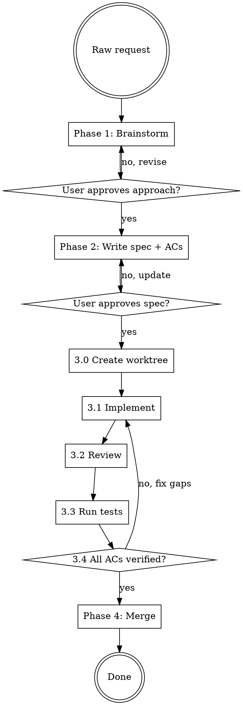

# Implementing From Request

## Overview

Transforms a raw request into merged code through four structured phases: **brainstorm → spec → implement/review/test loop → merge**.

**Core principle:** Never write code until acceptance criteria are defined and agreed. Never merge until all AC are verified.

**HARD GATE:** Do NOT start Phase 2 (spec) without completing Phase 1 (brainstorming). Do NOT start Phase 3 (implementation) without user-approved spec. Do NOT proceed to Phase 4 (merge) without all AC verified green.

---

## Phase 1 — Brainstorming

**Goal:** Understand the request deeply before defining any spec.

1. Read project context: CLAUDE.md, recent commits, relevant source files
2. Ask clarifying questions **one at a time**:
   - What problem does this solve?
   - What are the constraints or non-goals?
   - How will we know it's done? (success criteria)
3. Propose 2-3 implementation approaches with trade-offs and a recommendation
4. Get user approval on the approach

**Do NOT skip this phase** even for "simple" requests. Undefined requirements cause rework.

---

## Phase 2 — Spec & Acceptance Criteria

**Goal:** Create a written, agreed-upon definition of done.

After brainstorming is approved:

1. Write spec file to `docs/planning-by-workflow/YYYY-MM-DD-<topic>.md`:

```markdown
# [Request Title]

## Context
[1-2 sentences on why this is being done]

## Approach
[Chosen approach from brainstorming]

## Acceptance Criteria
- [ ] AC-01: [verifiable, specific, testable condition]
- [ ] AC-02: [verifiable, specific, testable condition]
- [ ] AC-03: [...]

## Out of Scope
- [explicit non-goals]
```

2. Present the spec to the user and ask for approval:
   > "Spec written to `docs/planning-by-workflow/YYYY-MM-DD-<topic>.md`. Review the acceptance criteria — do they correctly capture done?"

3. **Wait for explicit approval before continuing.** If the user requests changes, update and re-present.

**ACs must be:**
- Verifiable (can be checked with a test or manual step)
- Specific (no ambiguous language)
- Complete (if all ACs are green, the work is done)

---

## Phase 3 — Iterative Implementation Loop

**Goal:** Implement in isolation, iterating until all ACs pass review and tests.

### 3.0 — Worktree Setup

Use **superpowers:using-git-worktrees** to create an isolated worktree:
- Branch name: `feature/<topic>` or `fix/<topic>`
- Run baseline tests — confirm clean start before writing code

### 3.1 — Implementation

Dispatch an implementation subagent with:
- The spec file path
- The list of ACs to satisfy
- The project conventions (CLAUDE.md, relevant patterns)
- Files to read (not their contents — let the subagent read them)

The subagent should write minimal code to satisfy the ACs. No extra features.

### 3.2 — Review

After implementation, dispatch a **review subagent** with:
- The spec file path (for AC compliance check)
- The diff of changes (not full files — review the delta)
- Review criteria:
  1. Does the implementation satisfy each AC? (check one by one)
  2. Code quality: readable, consistent naming, no dead code
  3. Architecture: follows project patterns from CLAUDE.md
  4. Security: no OWASP Top 10 issues, no hardcoded secrets
  5. Tests: cover ACs, meaningful assertions, no flaky tests

Review output format:
```
REVIEW RESULT

AC Compliance:
- AC-01: ✅ satisfied / ❌ not satisfied [reason]
- AC-02: ✅ satisfied / ❌ not satisfied [reason]

Issues:
🔴 CRITICAL [file:line] — [problem] — [fix suggestion]
🟡 IMPROVEMENT [file:line] — [problem] — [fix suggestion]

Verdict: PASS / FAIL
```

### 3.3 — Testing

Run the project test suite:
```bash
npm test   # or cargo test / pytest / go test ./...
```

**If tests fail:** Return to 3.1 with the failures as input.

### 3.4 — AC Verification Gate

Check each AC from the spec file:
- For each AC, determine if it is satisfied (by code inspection, test results, or manual check)
- Mark satisfied ACs with ✅ in the spec file
- Any ❌ AC → return to 3.1 with that AC as the implementation target

**Loop 3.1 → 3.2 → 3.3 → 3.4 until:**
- All ACs are ✅
- All tests pass
- No 🔴 CRITICAL review issues remain

**If loop exceeds 4 iterations:** Stop and surface blockers to the user with a clear summary of what's failing and why.

---

## Phase 4 — Merge

**Gate:** All ACs ✅, all tests passing, no critical review issues.

Use **superpowers:finishing-a-development-branch** to present merge options:
1. Merge locally to current branch
2. Push and create PR
3. Keep branch as-is
4. Discard

Default recommendation: option 1 (merge locally) unless the project uses PR workflow.

Before merging: update the spec file, marking all ACs as completed.

---

## Process Flow



---

## Quick Reference

| Phase | Gate to proceed | Output |
|-------|----------------|--------|
| 1 Brainstorm | User approves approach | Agreed approach |
| 2 Spec/ACs | User approves spec | `docs/planning-by-workflow/*.md` with ACs |
| 3 Implement loop | All ACs ✅, tests pass, no 🔴 issues | Code + tests in worktree |
| 4 Merge | Phase 3 gate passed | Changes on target branch |

---

## Common Mistakes

**Starting to code before spec is approved**
- Problem: Implementing the wrong thing, wasted effort
- Fix: HARD GATE — no code until spec has explicit user approval

**Vague acceptance criteria**
- Problem: Can't verify done, loop never terminates
- Fix: Each AC must answer "how would I check this with a test or manual step?"

**Skipping the worktree**
- Problem: In-progress code pollutes the main branch
- Fix: Always use superpowers:using-git-worktrees before any implementation

**Merging with failing ACs**
- Problem: Spec says done, code says not done
- Fix: Phase 4 gate checks each AC explicitly before any merge option is presented

**Loop never terminating due to scope creep**
- Problem: Each review finds new requirements not in ACs
- Fix: If new requirements emerge during review, update the spec first and get user approval before implementing them

---

## Required Skills

- **REQUIRED:** superpowers:using-git-worktrees — for Phase 3.0
- **REQUIRED:** superpowers:finishing-a-development-branch — for Phase 4
- **BACKGROUND:** superpowers:test-driven-development — for Phase 3.1
- **BACKGROUND:** superpowers:dispatching-parallel-agents — for parallel subagents in Phase 3
